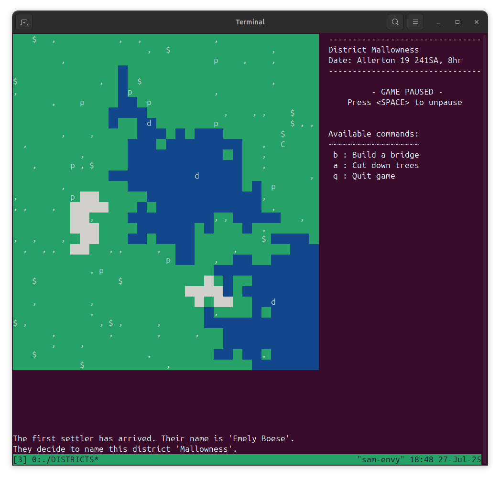
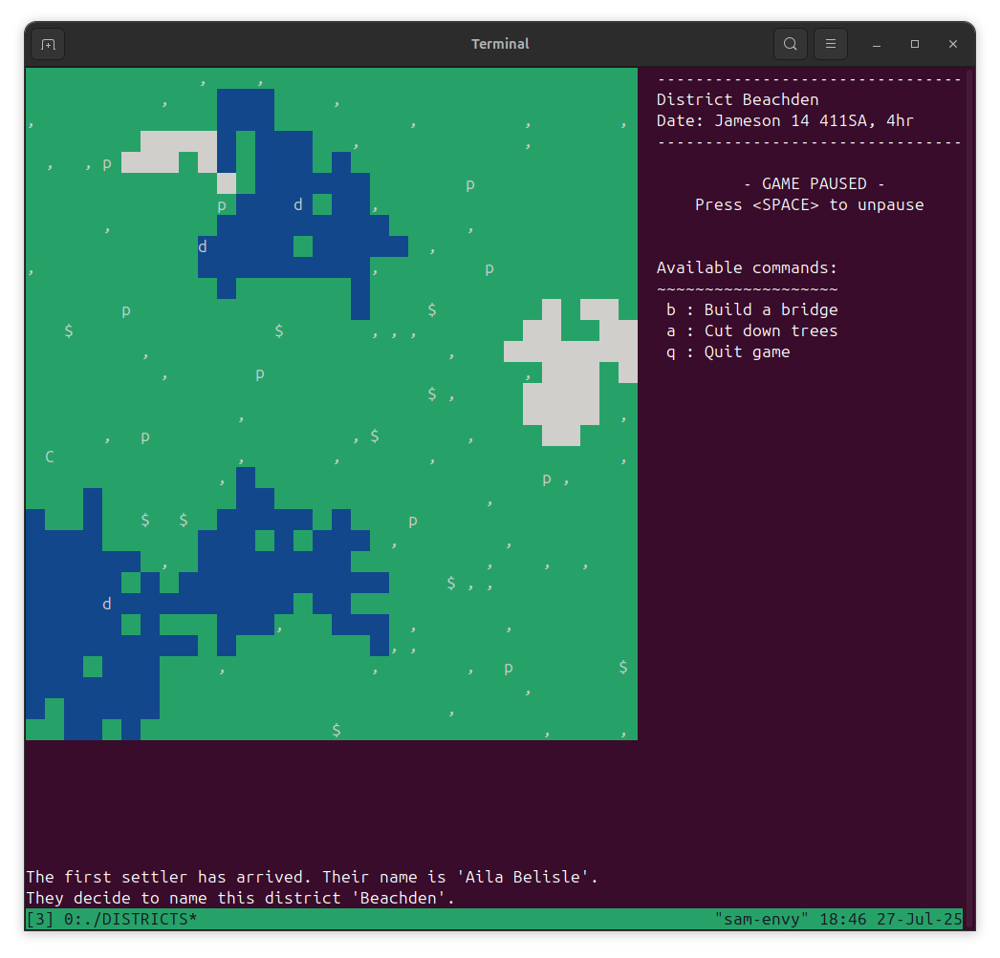

# DISTRICTS
DISTRICTS is a work-in-progress procedural base building and management game. It is heavily inspired by Dwarf Fortress in its style and functionality.
Currently the game is very limited, and right now couldn't really be classed as a proper game, but this will hopefully change in future as gameplay features are added and the project expands over time.

	
	

## Building the game
Right now the game is only available for Linux. If you have a burning desire to try it out on Windows or MacOS, let me know!
To build the game, simply run `make` or `make all` in the top-level directory. The executable will be created in a `bin` directory.
The game must build with `ncurses`, so this must be available on your system - it should be available within the `libncurses-dev` package through your package manager.

## Gameplay features
The game is currently very limited in terms of gameplay features:
- Dynamic district generation
- Different terrain types (plains, stone, water)
- Different entity types (citizen, duck, pigeon, tree, sapling)
- The citizen can work on jobs issued by the player, like chopping trees or building bridges

## Controls
- `SPACE` to pause and unpause the game
- A list of player commands is shown while the game is paused
- After selecting a command, use the `ARROW KEYS` to move the highlighted tile
- Hit `ENTER` to confirm the command on the highlighted tile
- Hit `Q` to cancel a selected command
- Hit `Q` twice to quit the game if no other command is selected

## Bugs, improvements & suggestions
Let me know if you have any thoughts! Whether you've found a bug, really like a certain feature, really hate a certain feature,
or just have some ideas about what could be included in the game - I'd love to hear what you have to say.
